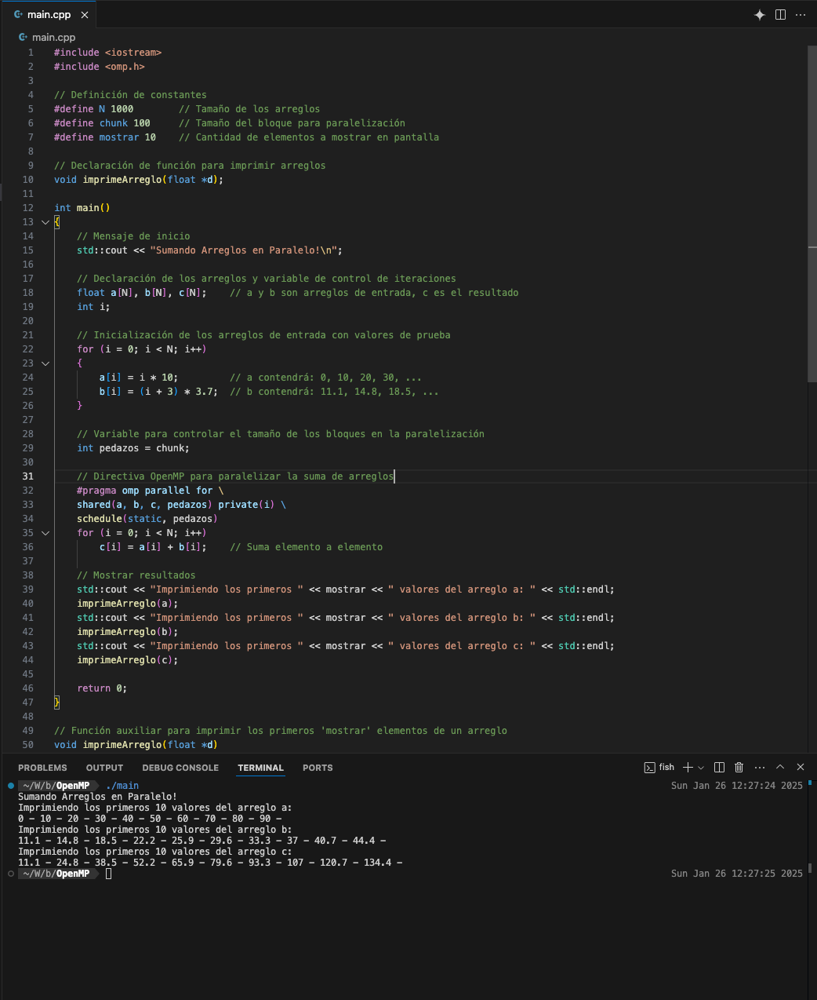

# Introducción
Los sistemas computacionales actuales son capaces de realizar un gran volúmen de operaciones de manera muy eficaz, y aunque en la actualidad el diseño de hardware permite tener equipos de cómputo de gran capacidad, aún es muy importante el uso eficiente de técnicas y arquitecturas que permitan optimizar el uso de recursos. Específicamente, para el cómputo en la nube, un uso eficiente de recursos se traduce en un ahorro significativo de costos. Esto nos motiva a revisar técnicas de programación paralela.

La programación paralela es una técnica de programación que permite ejecutar múltiples procesos simultáneamente. En este proyecto, utilizaremos OpenMP para crear una solución paralela para la suma de arreglos. Nuestro objetivo es explorar las capacidades de OpenMP para resolver problemas de manera paralela, a un problema sencillo, pero que permita observar los beneficios de la computación paralela.


# Liga del repositorio
El código explicado de este document puede encontrarse en esta liga:
[https://github.com/nessBautista/OpenMP_example](https://github.com/nessBautista/OpenMP_example)!


Para compilar y ejecutar el código, se ha usado vscode. La carpeta `.vscode` contiene la configuración necesaria para compilar y ejecutar el código desde vscode. 


# Ejecuciones del Proyecto
A continuación se muestran 2 ejecuciones del programa, con las variables usadas y con los resultados de cada una.

En la primera ejecución usaremos arreglos con un tamaño de 1000, un chunk de 100 y un número de elementos a mostrar de 10:
```c++
#define N 1000        // Tamaño de arreglos
#define chunk 100     // Tamaño de bloques para paralelización
#define mostrar 10    // Número de elementos a mostrar
```



En la segundo ejecución aumentaremos el tamaño por un factor de 100x, mantenemos el chunk de 100 y el número de elementos a mostrar de 10:
```c++
#define N 100000        // Tamaño de arreglos
#define chunk 100     // Tamaño de bloques para paralelización
#define mostrar 10    // Número de elementos a mostrar
```
Tambien cambiaremos ligaremente la inicialización del arreglo b, para que los resultados sean diferentes.

```c++
b[i] = (i + 3) * 10.7;  
```


## Explicación del Código y Resultados
#### Overview del código
El programa que se ha implementado ejecuta una suma de arreglos de manera paralela usanfo OpenMP. El tamaño de los arreglos será de `N`. La suma se realiza por medio de un ciclo `for`, OpenMP nos ayudará a paralelizar el ciclo, realizando la suma de manera concurrente. Si no se especifica el número de hilos, OpenMP usará el número de hilos que tenga el procesador. Al realizar la iteración en el ciclo `for`, se utilizara la variable `chunk=pedazos` para indicar el tamaño de los bloques que se le asignará a cada hilo, para que cada hilo realice la suma de manera concurrente.

#### Explicación de la ejecución

Comenzamos definiendo las constantes que usaremos en el programa, como el tamaño de los arreglos, el tamaño de los bloques y el número de elementos a mostrar. Usaremos las variables usadas en nuestra primera ejecución.

```c++
#define N 1000        // Tamaño de arreglo
#define chunk 100     // Parallelization block size
#define mostrar 10    // Number of elements to display
```

Para visualizar los resultados usaremos una función de `utility` que se encargará de imprimir los primeros elementos de un arreglo, usando la variable `mostrar`.

```c++
// Función auxiliar para imprimir los primeros 'mostrar' elementos de un arreglo
void imprimeArreglo(float *d)
{
    for (int x = 0; x < mostrar; x++)
        std::cout << d[x] << " - ";
    std::cout << std::endl;
}
```

Luego, procedemos a inicializar los arreglos `a` y `b` con valores de prueba. El tamaño del arreglo `c` será el mismo que el de `a` y `b`, sin embargo, este arreglo no se inicializa, ya que se usará para almacenar el resultado de la suma paralelade los arreglos `a` y `b`.
```c++
    // Declaración de los arreglos y variable de control de iteraciones
    float a[N], b[N], c[N];    // a y b son arreglos de entrada, c es el resultado
    int i;

    // Inicialización de los arreglos de entrada con valores de prueba
    for (i = 0; i < N; i++)
    {
        a[i] = i * 10;         
        b[i] = (i + 3) * 10.7;  
    }
```

OpenMP hace uso de directivas `#pragma` para indicarle al compilador como realizar la paralelización. Desde nuestro punto de vista, podemos entender que OpenMP usa `#pragma` para aumentar las capacidades de un ciclo `for`. Esto le permite integrarse a a programas, sin tener que modificar el código existente pero amentando la eficiencia del programa con programación paralela.

En estas lineas se especifican las variables que se compartirán entre los hilos, las variables que se usarán de manera privada y el tipo de scheduling que se usará.
```c++
#pragma omp parallel for \
shared(a, b, c, pedazos) private(i) \
schedule(static, pedazos)
```
- `shared(a, b, c, pedazos)`: Los arreglos y el tamaño de los bloques se compartirán entre los hilos. 
- `private(i)`: Cada hilo tendrá su propio contador de iteraciones. Esto es importante para evitar que los hilos acceden a la misma variable al mismo tiempo.
- `schedule(static, pedazos)`: El scheduling se realizará de manera estática, y el tamaño de los bloques será de `pedazos`.

Finalmente se realiza la suma de los arreglos `a` y `b`, y se almacena el resultado en el arreglo `c`.
Supongamos que nuestro sistema proveera de 4 hilos de ejecución. Nuestras iteraciones se dividirán en cada uno de estos hilos, usando, el tamaño `chunk` o `pedazos` para indicar el tamaño de los bloques que se le asignará a cada hilo. Lo podemos visualizar de la siguiente manera:
```c++
Thread 1: [0-99], [400-499], [800-899]
Thread 2: [100-199], [500-599], [900-999]
Thread 3: [200-299], [600-699]
Thread 4: [300-399], [700-799]
```

Es decir, nuestro arreglo `c` que inicialmente no tiene valores, comenzara a tener las sumas de los arreglos `a` y `b` en las posiciones que estan siendo procesadas en cada hilo. Para nuestro ejemplo, con 1000 elementos, divididos en 4 hilos, con 100 bloques, podemos visualizar el primer bloque de iteración de la siguiente manera:
```c++
Thread 1: c[0,1,2....]   
Thread 2: c[100,101,102...]
Thread 3: c[200,201,202...]
Thread 4: c[300, 301, 302...]
```

Es decir, nuestro arreglo `c` comenzará a tener valores en las posiciones que estan siendo procesadas en cada hilo. Si visualizamos los primeros 3 pasos del ciclo `for`, podriamos observar que nuestro arreglo `c` tendrá valores en las siguientes posiciones:
```c++
c[0,1,2......100,101,102,.....200,201,202.....300,301,302]
```

## Reflexión sobre la Programación Paralela
La programación paralela ofrece ventajas significativas en términos de rendimiento y eficiencia:
- Permite aprovechar múltiples núcleos de procesamiento
- Reduce el tiempo de ejecución en operaciones con grandes conjuntos de datos
- Facilita la escalabilidad de las aplicaciones
- En particular la librería OpenMP nos permite realizar la paralelización de manera sencilla, sin tener que modificar el código existente. 
Estas ventajas son muy importantes en el contexto de la nube, que si bien es una herramienta que nos permite tener un gran poder de cómputo, resulta aún muy importante el uso de técnicas eficientes de uso de recursos para reducir costos.
